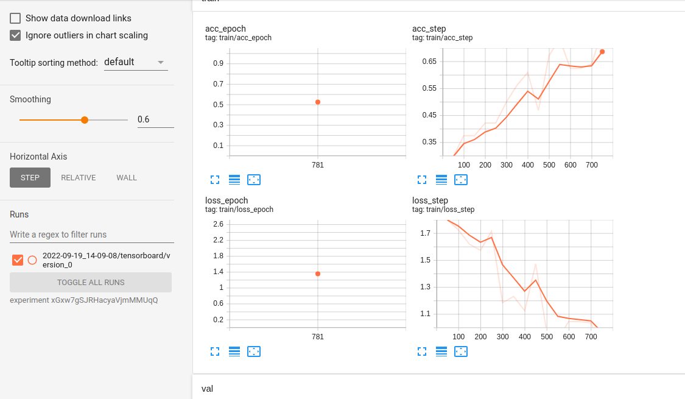
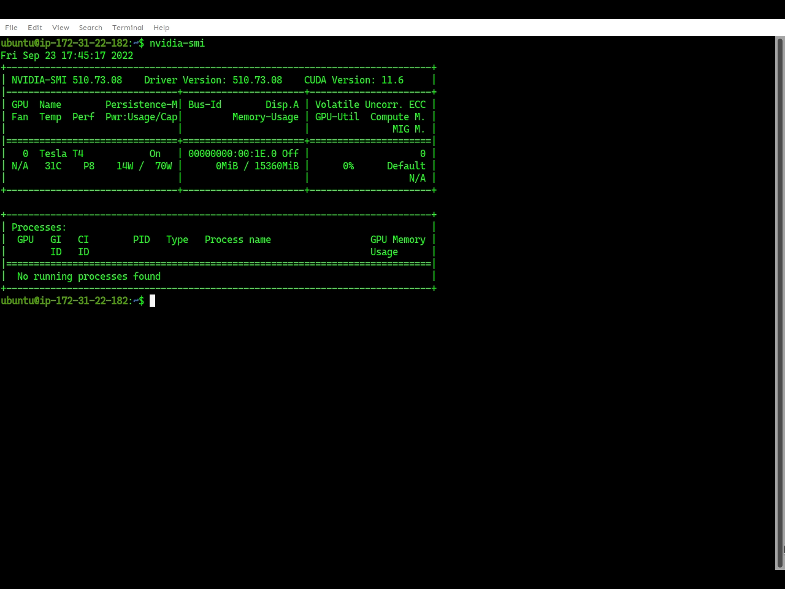

# EMLO Session 3

Tasks:
- [x] Use DVC to track data
- [x] Upload data to Google Drive via DVC (and share link)
- [x] Track experiment and log via Tensorboard
- [x] Share URL for Tensorboard Dev
- [x] Run hyperparameter tuning via Optuna


## Tracking using DVC, Tensorboard
First, we initialize DVC in our working directory.

```bash
git init
dvc init
```


After running the train.py script, it downloads the data. 

```bash
python src/train.py experiment=timm.yaml trainer.max_epochs=1 trainer.min_epochs=1 +trainer.num_sanity_val_steps=0
```

We can open tensorboard to view the logs.

```bash
tensorboard --logdir ./logs/train/runs --bind_all
```


Also, we can upload our tensorboard logs to TensorBoard.dev
```bash
tensorboard dev list # to authenticate
tensorboard dev upload --logdir ./logs/train/runs \
    --name "Simple experiment with MNIST" \
    --description "Training results for MMG for EMLO-s2" \
    --one_shot
```
The uploaded logs can be viewed at this [URL](https://tensorboard.dev/experiment/xGxw7gSJRHacyaVjmMMUqQ/)

 

To upload data to Google Drive via DVC, run the following commands.

```bash
dvc add data
dvc add logs
git add .
dvc config core.autostage true
dvc remote add gdrive gdrive://1oWD45ouMNc_Shthm3gFgY5kH7J5DaMV6
dvc push -r gdrive
```

The uploaded data can be viewed at this [URL](https://drive.google.com/drive/folders/1oWD45ouMNc_Shthm3gFgY5kH7J5DaMV6)


## Hyperparameter Tuning
Optuna was used for hyperparameter tuning. Since I don't own a GPU, an EC2 instance (g4dn.xlarge) was used to run the tuning.

GPU:


To save time, only one epoch was used for each trial. For training on GPU, I had to explicitly specify the `accelerator=gpu` option.

```bash
python3 src/train.py -m hparams_search=cifar10_optuna trainer.max_epochs=1 trainer.accelerator='gpu' trainer.devices=1
```

The training video is [uploaded here](https://www.youtube.com/watch?v=NWPGnX5f6AQ).